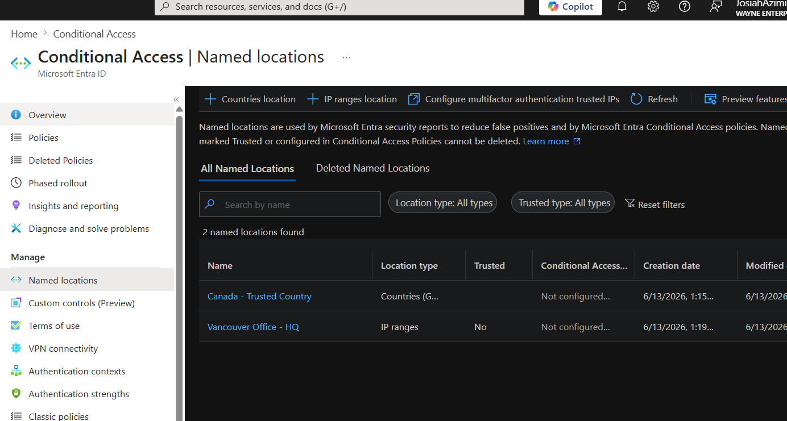
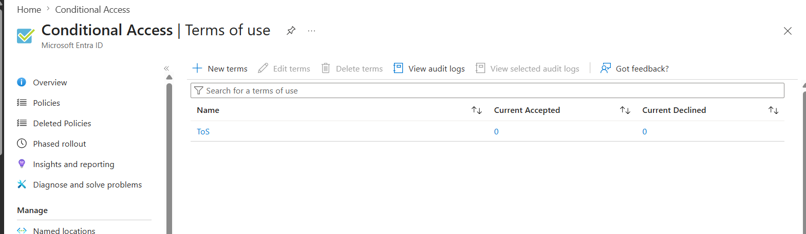
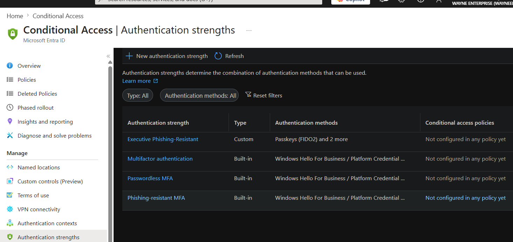
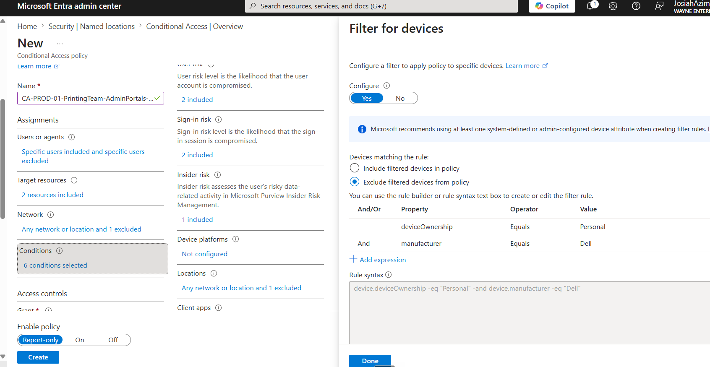
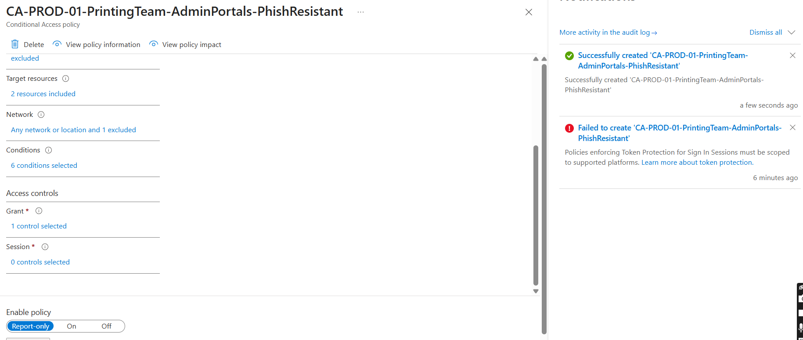

# Microsoft Entra ID — Conditional Access Configuration Lab

> A hands-on walkthrough of configuring Conditional Access policies in Microsoft Entra ID, covering named locations, authentication strengths, terms of use, and policy creation with modern Zero Trust best practices.

---

## 📋 Table of Contents

- [Overview](#overview)
- [Prerequisites](#prerequisites)
- [Lab Steps](#lab-steps)
  - [Step 1 — Review What's New in Entra ID](#step-1--review-whats-new-in-entra-id)
  - [Step 2 — Configure Named Locations](#step-2--configure-named-locations)
  - [Step 3 — Configure Terms of Use](#step-3--configure-terms-of-use)
  - [Step 4 — Configure Authentication Strengths](#step-4--configure-authentication-strengths)
  - [Step 5 — Create a Conditional Access Policy from Scratch](#step-5--create-a-conditional-access-policy-from-scratch)
  - [Step 6 — Configure Grant Controls](#step-6--configure-grant-controls)
  - [Step 7 — Configure Session Controls](#step-7--configure-session-controls)
  - [Step 8 — Enable and Monitor the Policy](#step-8--enable-and-monitor-the-policy)
- [Screenshots](#screenshots)
- [Best Practices Summary](#best-practices-summary)
- [Key Concepts Reference](#key-concepts-reference)
- [Resources](#resources)

---

## Overview

This lab demonstrates how to configure **Microsoft Entra ID Conditional Access** as part of a Zero Trust security model. Conditional Access acts as the policy engine at the heart of Zero Trust — it evaluates signals (user, location, device, app, risk) and enforces access decisions in real time.

**Licensing requirements:**
- Conditional Access → Entra ID P1 (included in Microsoft 365 Business Premium)
- Identity Protection → Entra ID P2

---

## Prerequisites

- An active Microsoft Entra ID tenant (trial or production)
- Global Administrator or Conditional Access Administrator role
- Microsoft Entra ID P1 or P2 license (or Microsoft 365 Business Premium)
- Optionally: Microsoft Intune for device compliance policies

---

## Lab Steps

---

### Step 1 — Review What's New in Entra ID

**Goal:** Stay current with platform changes before modifying any configuration.

1. Sign in to the [Microsoft Entra admin center](https://entra.microsoft.com).
2. In the left navigation, locate and click **What's new**.
3. Review recent announcements, paying attention to:
   - New features entering General Availability (GA)
   - Features moving from Preview to GA
   - Upcoming enforcement changes (e.g., MFA requirements for admin accounts)
4. Note any features that may affect existing policies in your tenant.

> **Why this matters:** Entra ID is updated continuously. Reviewing the What's New section regularly ensures you are not surprised by automatic policy enforcement or deprecated features.

---

### Step 2 — Configure Named Locations

**Goal:** Define trusted geographic or network locations to be referenced in Conditional Access policies.

Named locations act as trusted signals. Users authenticating from a trusted location can be granted different access conditions than those from unknown or high-risk locations.

#### 2a — Create a Country-Based Location

1. Navigate to **Protection** → **Conditional Access** → **Named locations**.
2. Click **+ New location** → **Countries location**.
3. Enter a descriptive name (e.g., `Canada - Trusted Country`).
4. Search for and select the target country.
5. Choose a lookup method:
   - **IP address** — uses the connecting IP to determine country
   - **GPS coordinates** — uses device GPS (useful for mobile/travelling users)
6. Optionally check **Include unknown countries and regions** if you want to capture unresolvable locations.
7. Click **Create**.

#### 2b — Create an IP Range Location

1. Click **+ New location** → **IP ranges location**.
2. Enter a descriptive name (e.g., `Vancouver Office - HQ`).
3. Add the IPv4 or IPv6 address ranges for your office network.
4. Mark it as a **trusted location** if appropriate.
5. Click **Create**.

> **Best practice:** Named locations marked as trusted can be used to exempt users from additional authentication requirements when they are on-premises.

#### Screenshot
<!-- Add your screenshot here -->

---

### Step 3 — Configure Terms of Use

**Goal:** Create an acceptable use agreement that users must acknowledge before accessing company resources.

Terms of Use are particularly important for guest users, partners, and any user accessing sensitive applications.

1. Navigate to **Protection** → **Conditional Access** → **Terms of use**.
2. Click **+ New terms**.
3. Fill in the details:
   - **Name** — internal reference name (e.g., `Corporate Terms and Conditions`)
   - **Display name** — what users will see
   - **Terms of use document** — upload a PDF containing your organization's acceptable use policy
   - **Language** — set the default language; additional languages can be added
4. Configure consent options:
   - **Require users to expand the terms** — forces users to scroll through the document
   - **Require consent on every device** — users must re-consent on each device they use
   - **Expire consents** — set an expiry frequency (annual, quarterly, monthly, etc.)
5. Click **Create**.
6. Optionally, create a Conditional Access policy scoped specifically to enforce these terms.

> **Best practice:** Always include a Terms of Use requirement for guest and external users. Set an annual expiry to ensure continued acknowledgement.

#### Screenshot
<!-- Add your screenshot here -->

---

### Step 4 — Configure Authentication Strengths

**Goal:** Define custom sets of allowed authentication methods to be enforced within policies.

Authentication strengths let you go beyond simple MFA — you can require phishing-resistant credentials for sensitive roles or locations.

1. Navigate to **Protection** → **Conditional Access** → **Authentication strengths**.
2. Review the built-in options:
   - **Multi-factor authentication** — broad MFA requirement
   - **Passwordless MFA** — Microsoft Authenticator, FIDO2 keys
   - **Phishing-resistant MFA** — passkeys (device-bound or synced), FIDO2 security keys
3. Click **+ New authentication strength** to create a custom definition.
4. Enter a name (e.g., `Executive Phishing-Resistant Auth`).
5. Select only the methods you want to permit. For example:
   - Passkeys (FIDO2)
   - Microsoft Authenticator (passwordless)
   - QR code + PIN (for frontline/call centre workers)
6. Click **Next**, review the summary, then click **Create**.

> **Best practice:** Create a dedicated authentication strength for administrator accounts that permits only phishing-resistant methods (FIDO2 / passkeys). Avoid relying on SMS OTP for privileged roles.

#### Screenshot
<!-- Add your screenshot here -->

---

### Step 5 — Create a Conditional Access Policy from Scratch

**Goal:** Build a policy that enforces phishing-resistant authentication for a specific user group accessing cloud portals.

1. Navigate to **Protection** → **Conditional Access** → **Policies**.
2. Click **+ New policy**.
3. Enter a descriptive name following a naming convention (e.g., `CA-PROD-01-PrintingTeam-AdminPortals-PhishResistant`).

#### 5a — Assign Users and Groups

4. Under **Users**, click **0 users and groups selected**.
5. On the **Include** tab, choose **Select users and groups** → **Users and groups**.
6. Search for and select the target group (e.g., your Printing team security group).
7. Switch to the **Exclude** tab and add your **break-glass emergency access accounts**.

> **Critical:** Always exclude break-glass accounts from any policy that could block sign-in.

#### 5b — Select Target Resources

8. Under **Target resources**, click **No target resources selected**.
9. Choose what to include:
   - **All cloud apps** — broadest coverage
   - **Select apps** — scoped to specific applications (e.g., Office 365, Microsoft Admin Portals)
10. For this lab, select **Microsoft Admin Portals** and **Office 365** to scope the policy.

#### 5c — Configure Network Conditions

11. Under **Network**, toggle **Configure** to **Yes**.
12. On the **Include** tab, select **Any network or location**.
13. On the **Exclude** tab, add your trusted named locations (created in Step 2) to exempt on-premises users.

#### 5d — Configure Risk and Other Conditions

14. Under **Conditions**, configure as needed:
    - **User risk** — set to **High** and **Medium** to enforce controls for risky users
    - **Sign-in risk** — set to **High** and **Medium**
    - **Insider risk** (if using Microsoft Purview) — enable and set threshold
    - **Client apps** — select **Browser** and deselect legacy authentication clients
    - **Filter for devices** — optionally scope to corporate-owned devices only, or exclude personal devices using expressions (e.g., `deviceOwnership = Personal`)

> **Security note:** Exclude legacy authentication clients. Legacy protocols such as SMTP AUTH and older Exchange clients cannot perform MFA and represent a significant attack surface.

#### Screenshot
<!-- Add your screenshot here -->

---

### Step 6 — Configure Grant Controls

**Goal:** Define what the user must satisfy in order to be granted access.

1. Under **Grant**, click **0 controls selected**.
2. Select **Grant access**.
3. Choose your enforcement requirement. For this lab:
   - **Require authentication strength** → select the custom strength created in Step 4
   - Optionally add: **Require device to be marked as compliant** (requires Intune)
   - Optionally add: **Require Hybrid Azure AD joined device**
   - Optionally add: **Require approved client app**
   - Optionally add: **Require app protection policy**
4. If selecting multiple controls, choose whether **all** or **one** of the selected controls must be satisfied.
5. Click **Select**.

#### Screenshot
<!-- Add your screenshot here -->

---

### Step 7 — Configure Session Controls

**Goal:** Control the behaviour of authenticated sessions to limit token replay and reduce session persistence risks.

1. Under **Session**, click **0 controls selected**.
2. Configure the following as appropriate:

| Control | Recommended Setting | Notes |
|---|---|---|
| **Sign-in frequency** | Periodic reauthentication — e.g., 1–4 hours | Reduce for privileged or sensitive roles |
| **Persistent browser session** | **Never persistent** | Prevents "keep me signed in" tokens |
| **Continuous Access Evaluation (CAE)** | **Strictly enforce location policies** | Real-time policy evaluation; highly recommended |
| **Require token protection** | **Enabled** (Preview) | Mitigates adversary-in-the-middle token replay attacks |
| **Use app enforced restrictions** | Enable if using SharePoint or Exchange session policies | Controls download/print/copy behaviour |

3. Click **Select**.

> **Best practice:** Enable Continuous Access Evaluation (CAE) on all policies. It ensures that if a user's risk level changes mid-session (e.g., account compromise detected), they are immediately challenged to reauthenticate rather than continuing on a stale token.

---

### Step 8 — Enable and Monitor the Policy

**Goal:** Deploy the policy safely and verify its effect using reporting and diagnostic tools.

#### 8a — Enable in Report-Only Mode First

1. At the bottom of the policy creation page, set the policy state to **Report-only**.
2. Click **Create**.
3. The policy will now log what *would* happen if it were enforced, without actually blocking any users.
4. Monitor the policy for a minimum of 7–14 days before enforcing.

> **Report-only mode** runs for 90 days by default, then transitions to enforced. Adjust this timeline according to your testing requirements.

#### 8b — Review Sign-In Logs

5. Navigate to **Monitoring & health** → **Sign-in logs**.
6. Select any sign-in event and open the **Conditional Access** tab.
7. Review:
   - Which policies applied
   - Which policies are in report-only mode and what they would have done
   - Grant result (success, failure, or not applied)

#### 8c — Use the What If Tool

8. Navigate to **Conditional Access** → **Policies** → **What If**.
9. Enter a test scenario:
   - User
   - IP address or named location
   - Target application
   - Device platform
10. Click **What If** to see which policies would apply and what the outcome would be.

> **Best practice:** Use the What If tool before enforcing any new policy to validate that it applies only to the intended users and scenarios, and that break-glass accounts are correctly excluded.

#### 8d — Switch Policy to Enforced

11. Once satisfied with report-only results, return to the policy.
12. Change the state from **Report-only** to **On**.
13. Click **Save**.

---

## Best Practices Summary

| # | Practice |
|---|---|
| 1 | Always create and exclude **break-glass emergency access accounts** from all policies |
| 2 | Start every new policy in **Report-only mode** before enforcing |
| 3 | Scope new policies to a **single test user or group** before broad rollout |
| 4 | Use **named locations** to reduce friction for users on trusted networks |
| 5 | Disable **legacy authentication** across all policies |
| 6 | Prefer **phishing-resistant MFA** (passkeys / FIDO2) for administrator accounts |
| 7 | Enable **Continuous Access Evaluation (CAE)** on all policies |
| 8 | Enable **Require token protection** (preview) to prevent token replay attacks |
| 9 | Configure **authentication strengths** rather than generic MFA requirements |
| 10 | Use the **What If** tool to validate policies before enforcement |
| 11 | Review **Identity Secure Score** regularly for improvement recommendations |
| 12 | Assign the **Conditional Access Administrator** role to specialists rather than granting Global Admin |

---

## Key Concepts Reference

| Term | Description |
|---|---|
| **Conditional Access** | Policy engine that evaluates signals and enforces access controls in real time |
| **Named Location** | A defined geographic region or IP range used as a signal in policies |
| **Authentication Strength** | A configurable set of allowed authentication methods required to grant access |
| **CAE (Continuous Access Evaluation)** | Real-time session monitoring that revokes or challenges sessions when risk changes mid-session |
| **Report-Only Mode** | Policy state that logs outcomes without enforcing — safe for testing |
| **Break-Glass Account** | Emergency access account excluded from all MFA/Conditional Access policies |
| **Phishing-Resistant MFA** | Authentication methods (FIDO2/passkeys) immune to credential phishing |
| **Token Replay Attack** | Attack where a stolen authentication token is reused by a threat actor |
| **Identity Protection** | Entra ID P2 feature that calculates user and sign-in risk scores |
| **What If Tool** | Diagnostic tool that simulates policy evaluation for a given user/scenario |
| **Zero Trust** | Security model assuming no implicit trust — every access request is verified |
| **PIM (Privileged Identity Management)** | Just-in-time privileged role activation to reduce standing admin access |

---

## Resources

- [Microsoft Entra admin center](https://entra.microsoft.com)
- [Conditional Access documentation](https://learn.microsoft.com/en-us/entra/identity/conditional-access/)
- [Emergency access (break-glass) accounts](https://learn.microsoft.com/en-us/entra/identity/role-based-access-control/security-emergency-access)
- [Authentication strengths](https://learn.microsoft.com/en-us/entra/identity/authentication/concept-authentication-strengths)
- [Continuous Access Evaluation](https://learn.microsoft.com/en-us/entra/identity/conditional-access/concept-continuous-access-evaluation)
- [Identity Secure Score](https://learn.microsoft.com/en-us/entra/identity/monitoring-health/concept-identity-secure-score)
- [What Is tool](https://learn.microsoft.com/en-us/entra/identity/conditional-access/what-if-tool)

---

*Lab based on Microsoft Entra ID Conditional Access — covering named locations, terms of use, authentication strengths, policy creation, session controls, and monitoring.*

Lab by Josiah Azimi